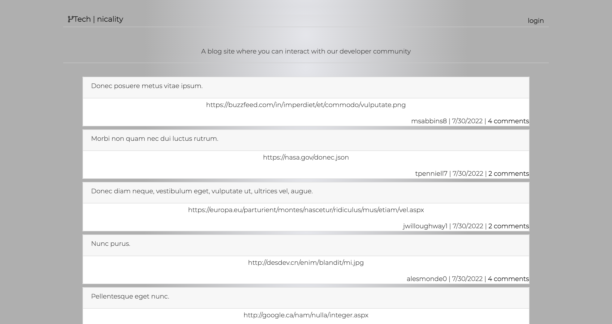

# MVC | tech-blog


## Description
Tech blog site where developers can publish their blog posts and comment on other developers’ posts. This app follows the MVC paradigm in its architectural structure, and uses Handlebars.js as the templating language, Sequelize as the ORM, and the express-session npm package for authentication.

## Table of Contents
- [User Story](#user-story)
- [Installation](#installation)
- [Usage](#usage)
- [Media](#media)
- [License](#license)
- [Contributing](#contributing)
- [Questions](#questions)
- [Credits](#credits)

## User Story

```
AS A developer who writes about tech
I WANT a CMS-style blog site
SO THAT I can publish articles, blog posts, and my thoughts and opinions
```

## Installation

Please fork this repository over to your local system. Then follow these steps below to initialize the npm modules and necessary seeds for the database.

1. Locate the `.env.EXAMPLE` file in this repository. Update the information with your MySQL user info. Rename the file `.env` to correctly configure the connection.

2. Open your command line and ensure that you are in the root of this repository. Then type in the following prompts in this order:

- `npm install`
- `mysql -u root` or `mysql -u root -p` and enter password
- `source db/schema.sql`
- `show databases` and confirm the techblog_db is listed
- `exit`
- `npm run seed`
- `npm start`

## Media

[Heroku Site Link](https://technicality.herokuapp.com/)




## License
This application is licensed under the MIT license. Please click on the link below to learn more.

https://opensource.org/licenses/MIT

## Contributing

Pull requests are welcome. For major changes, please open an issue first to discuss what you would like to change.

## Questions

Please direct any questions about this project to olivelliott48@gmail.com. If you would like to see more projects, visit the GitHub link below.

https://www.github.com/olivelliott